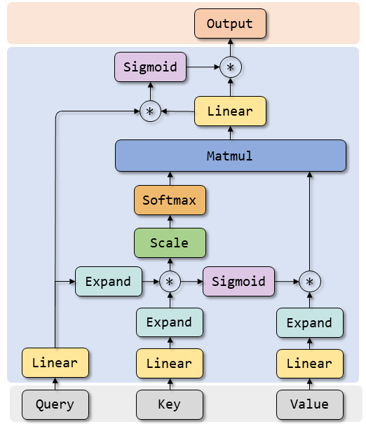
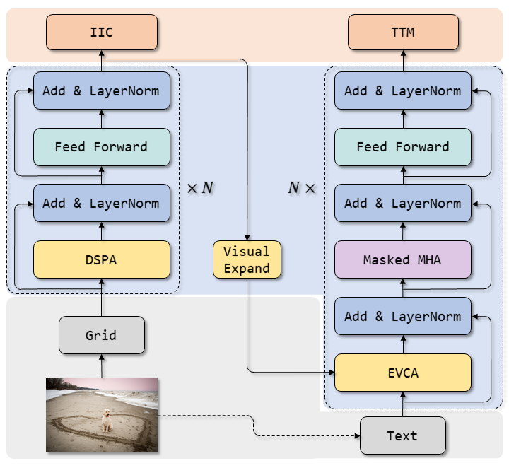
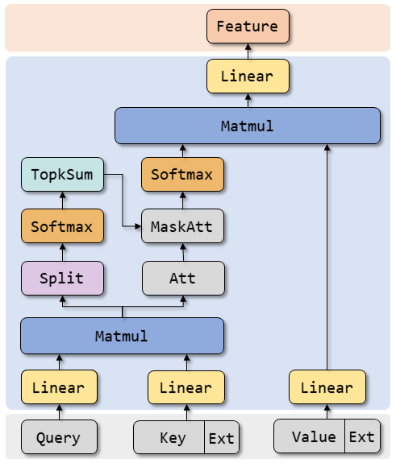

# Dual-Stage Pixel Transformer with Enhanced Visual Context for Image Captioning
This repository contains the reference code for the paper [null]()
| DSPA | Arch | EVCA |
|:---:|:---:|:---:|
||||

## Environment
Clone the repository and create the DSPT conda environment by executing the following command:
``` sh
sh environment.sh
```

## Data
To run the code, annotations, evaluation tools and visual features for the COCO dataset are needed.
- **Annotation**. Download the annotation file [annotations.zip](https://pan.baidu.com/s/1PuNfQnOhkNGNnNyEGxr9rQ). Acess code: labl. Extarct and put it in the project root directory.
- **Feature**. There's grid feature of MSCOCO dataset that you can download from [DLCT](https://github.com/luo3300612/image-captioning-DLCT), [DIFNet](https://github.com/mrwu-mac/DIFNet), or you can download it from [hdf5](https://pan.baidu.com/s/1Au97sw12o7UdrEZN_QRzBg). as I've just made a backup copy. Acess code: labl.
- **Evaluation**. [evaluation.zip](https://pan.baidu.com/s/1rAYvKcQOGkYoUPrTpY2qUQ). Acess code: labl. Extarct and put it in the project root directory.

Preprocessing of the Flicker Dataset in the **flicker_utils.py** File.

## Training
Train a model using the **MSCOCO** dataset. Run the following command:
``` sh
python train.py --exp_name DSPT --device cuda:0 --features_path ../coco_all_align.hdf5 --batch_size 50 --rl_batch_size 50
```
Train a model using the **Flicker8k** dataset. Run the following command:
``` sh
python flicker8k_train.py --exp_name flicker8k --features_path ../flicker8k.hdf5 --device cuda:0 --batch_size 25 --rl_batch_size 25
```
Train a model using the **Flicker30k** dataset. Run the following command:
``` sh
python flicker30k_train.py --exp_name flicker30k --features_path ../flicker30k.hdf5 --device cuda:0 --batch_size 25 --rl_batch_size 25
```
If it shows "out of graphics memory" after running, reduce the batch_size and rl_batch_size.

## Evaluation
To reproduce the results reported in our paper, download the pretrained model file [DSPT_X101.pth](). Acess code: labl. Evaluation a model using the **MSCOCO** dataset. Run the following command:
``` sh
python test.py --exp_name DSPT_X101 --features_path ../coco_all_align.hdf5 --device cuda:0
```
Download the pretrained model file [flicker8k.pth](https://pan.baidu.com/s/1u8wdx3LuQwWt5x2rNh3LUQ). Acess code: labl. Evaluation a model using the **Flicker8k** dataset. Run the following command:
``` sh
python flicker8k_train.py --exp_name flicker8k --features_path ../flicker8k.hdf5 --device cuda:0 --only_test
```
Download the pretrained model file [flicker30k.pth](https://pan.baidu.com/s/11RJjSDdYBlRkpmDfyfbR9w). Acess code: labl. Evaluation a model using the **Flicker30k** dataset. Run the following command:
``` sh
python flicker30k_train.py --exp_name flicker30k --features_path ../flicker30k.hdf5 --device cuda:0 --only_test
```

#### **Ensemble model**
It will search for and perform **Averaging Ensemble** on the features from all *_best_test.pth files located in the --pth_path folder. You can modify the **TransformerEnsemble** in /models/transformer/transformer.py to implement other types of ensemble methods.
``` sh
python test.py --is_ensemble
```

#### **Evaluation of some indicators**
``` sh
python eval.py
```

## Acknowledgements
Thanks Cornia et.al [M2 transformer](https://github.com/CorniaAI/M2Transformer)